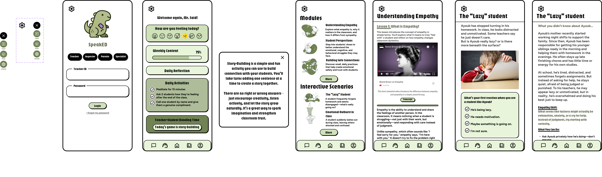
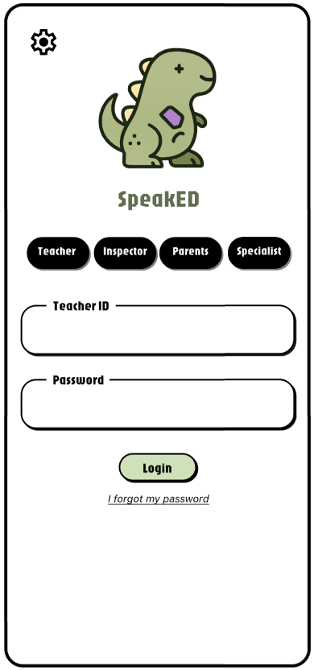
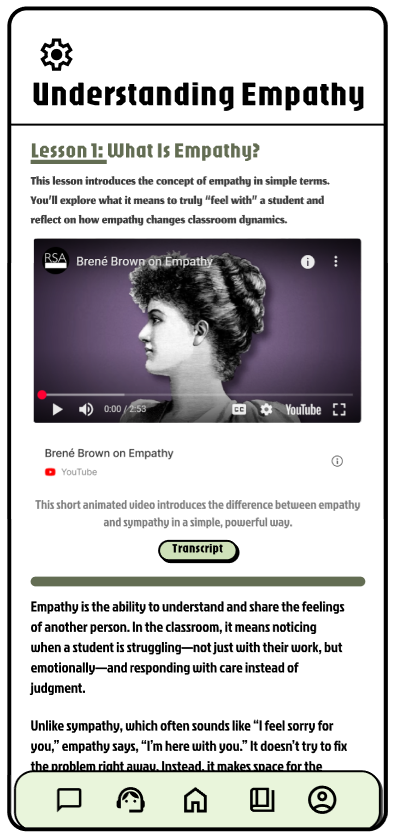
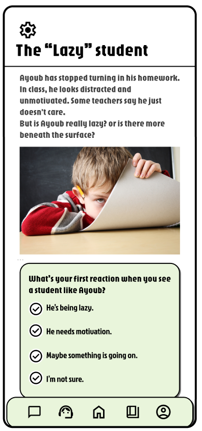

# SpeakED app design

***When teachers and students truly hear each other***

> A virtual training mobile app designed to help teachers better understand and empathize with their students. It offers short focused lessons, real-life classroom scenarios and contextual student stories that address managing challenging behaviors, building emotional connections and supporting neurodivergent students. The app also includes empathy-building activities, check-in strategies, collaborative games and adaptable classroom tips tailored to diverse students needs.

## Individual pages

